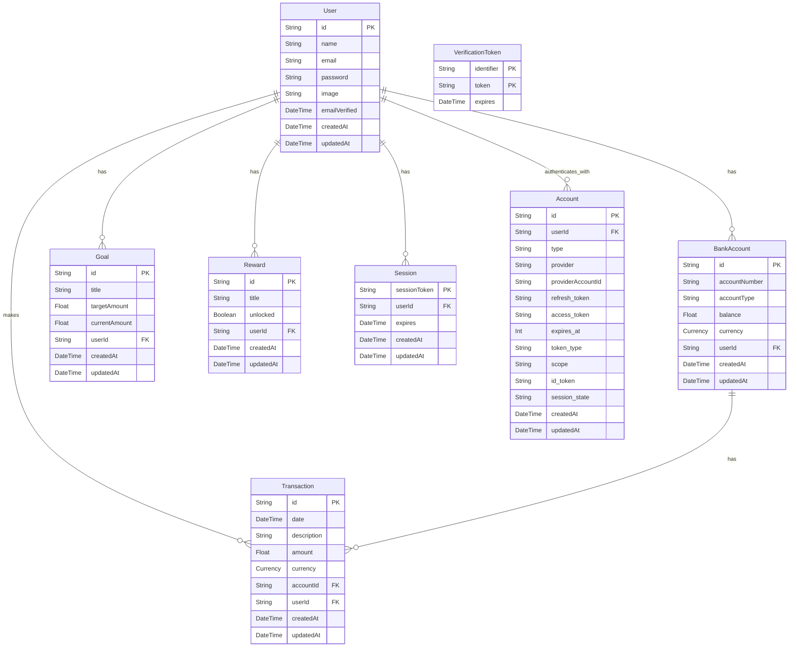

# 🤩 Entity Relationship Summary

### 🔍 Summary

- A **User** has many **Goals**, **BankAccounts**, **Transactions**, **Rewards**, **Sessions**, and **Auth Accounts**
- A **BankAccount** belongs to one **User** and has many **Transactions**
- A **Transaction** is linked to one **User** and one **BankAccount**
- A **Goal** and a **Reward** belong to one **User**

### 🗂 Legend

- `PK` = Primary Key
- `FK` = Foreign Key
- `||--o{` = One-to-many relationship

## 🧬 Mermaid Diagram

