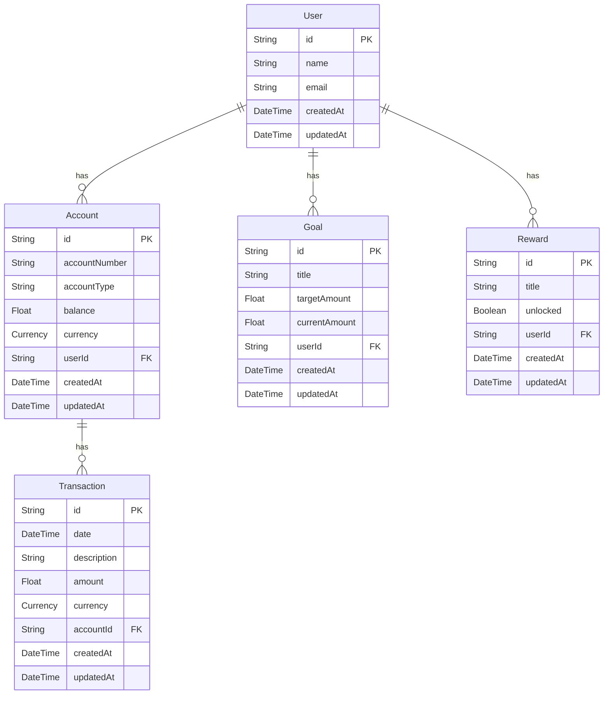

# 🧩 Entity Relationship Summary

### 🔍 Summary

- A **User** has many **Accounts**, **Goals**, and **Rewards**
- An **Account** belongs to one **User** and has many **Transactions**
- A **Transaction** is linked to one **Account**
- A **Goal** and a **Reward** belong to one **User**

### 🗂 Legend

- `PK` = Primary Key
- `FK` = Foreign Key
- `||--o{` = One-to-many relationship

## Mermaid Diagram

